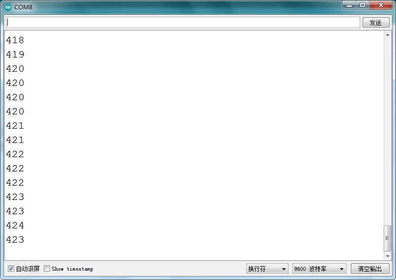

# Arduino


## 1. Arduino简介  

Arduino是一款开源硬件平台，旨在为爱好者和初学者提供简单易用的编程和控制解决方案。它由硬件（如Arduino主板）和软件（Arduino IDE）组成，用户可以通过C/C++语言编写代码，控制各种传感器和执行器。Arduino广泛应用于电子项目、艺术装置、机器人、物联网（IoT）等领域，因其易于学习和丰富的社区支持而受到欢迎。Arduino硬件通常配备多种输入输出接口，使其能够与多种传感器和设备连接，为用户提供了广泛的创作空间和实验可能性。  

## 2. 连接图  

  

## 3. 测试代码  

```cpp  
int val;  
int ntcPin = A0; // 设置NTC-MF52AT模拟温度传感器接模拟口A0  

void setup() {  
    Serial.begin(9600); // 设置波特率为9600  
}  

void loop() {  
    val = analogRead(ntcPin); // 读取温度模拟值  
    Serial.println(val); // 读取并打印热敏电阻模拟值  
    delay(100); // 延时100毫秒  
}  
```  

## 4. 测试结果  

按照上图接好线，烧录好代码后，上电后，我们可以在软件的串口监视器中看到当前环境中温度的模拟值，如下图所示。  




