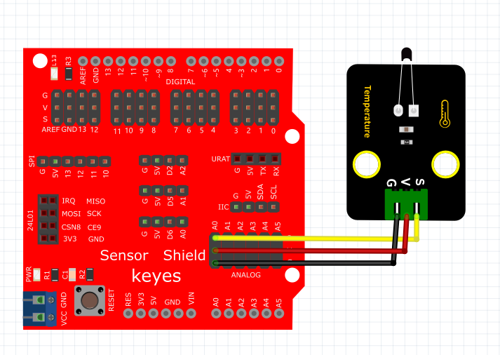

# KidsBlock

## 1. KidsBlock简介  

KidsBlock是一款为儿童和初学者设计的图形化编程工具，旨在通过简单直观的拖放式界面，让用户轻松创建交互式程序。用户无需深入理解复杂的编程语言，可以通过拼接模块实现各种功能。KidsBlock支持与Arduino硬件结合，使得用户能够实现多种创意项目，如传感器控制和机器人制作。其友好的用户界面以及丰富的模块选择，使得编程变得更加有趣和容易，是教育和创作的理想选择。  

## 2. 连接图  

  

## 3. 测试代码  

1. 在事件栏拖出Arduino启动模块。  

     

2. 在串口栏拖出设置串口波特率模块并设置波特率为9600；在引脚栏拖出设置引脚模块，然后设置引脚A0模式为输入。  

     

3. 在控制栏拖出重复执行模块。  

     

4. 在串口栏拖出串口打印模块，然后在引脚栏拖出读取模拟引脚模块并设置引脚为A0，最后再添加一个延时模块，延时为100ms。  

     

## 4. 测试结果  

按照上图接好线，烧录好代码后，上电后，我们可以在软件的串口监视器中看到当前环境中温度的模拟值，如下图所示。  

