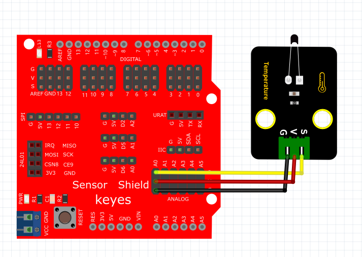
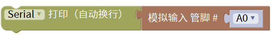
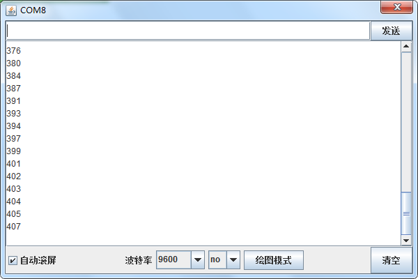

# Mixly

## 1. Mixly简介  

Mixly是一款图形化编程工具，专为儿童和初学者设计。通过直观的拖放式界面，用户可以轻松构建程序，而无需深入学习复杂的编程语言。Mixly支持Arduino硬件，因此用户能够快速实现创意项目，包括传感器控制和自动化设备。它不仅提供Scratch图形编程，还支持Arduino C语言，使学习编程变得更加有趣和灵活。Mixly的模块化设计鼓励用户通过实践探索编程的乐趣，并扩大他们的创造力。  

## 2. 连接图  

  

## 3. 测试代码  

1. 在串口栏拖出打印（自动换行）模块。  

     

2. 在输入/输出栏拖出模拟输入模块并设置管脚为A0，然后接在串口打印模块后面。  

     

3. 在控制栏拖出延时模块，并设置时间为100ms。  

     

## 4. 测试结果  

按照上图接好线，烧录好代码后，上电后，我们可以在软件的串口监视器中看到当前环境中温度的模拟值，如下图所示。  

