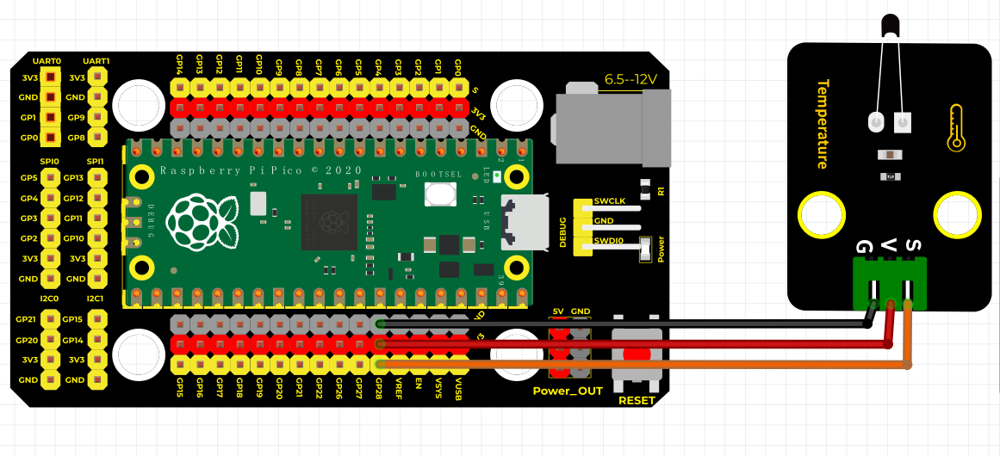
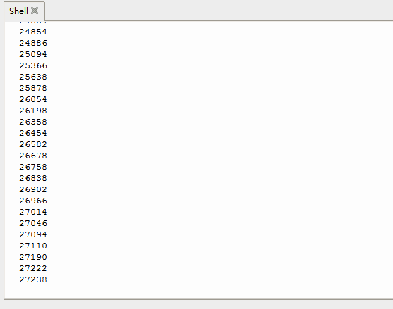

# Python


## 1. Python简介  

Python是一种广泛使用的高级编程语言，以其简单易读的语法和强大的功能而受到欢迎。它适合初学者和专业开发者，在多个领域内有着广泛的应用，包括Web开发、数据科学、人工智能、自动化以及科学计算。Python的设计哲学强调代码的可读性和简洁性，使得同样的功能能够通过更少的代码实现。它拥有丰富的库和框架，用户可以快速构建功能强大的应用程序。得益于其活跃的社区支持，Python也非常适合教育用途，帮助学生和新手迅速掌握编程基础。  

## 2. 连接图  

  

## 3. 测试代码  

```python  
import machine  
import utime  

ntcPin = machine.ADC(28)  # 设置ADC脚为28脚  

while True:  
    reading = ntcPin.read_u16()  # 读取模拟值  
    print(reading)  # 打印模拟值  
    utime.sleep_ms(100)  # 延时100ms  
```  

## 4. 测试结果  

按照上图接好线，烧录好代码后，上电后，我们可以在软件的串口监视器中看到当前环境中温度的模拟值，如下图所示。  




